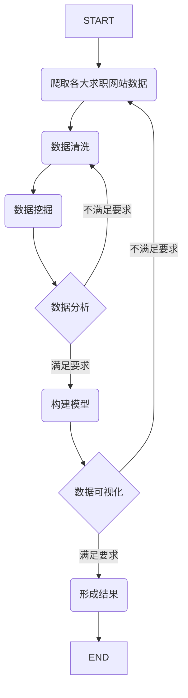

# “墨桐杯”大数据技能挑战赛

### 基于Scrapy+Python可视化的应届生就业职位热点分析
----------

##### 一、流程图

##### 二、详细计划

###### （1）数据爬取
  * 利用的技术： python、scrapy爬虫框架
  * 爬取的网站：
      * 大中型公司的企业招聘官网：Alibaba 阿里巴巴，Tencent 腾讯，Baidu 百度
      * 垂直行业招聘网站：BOSS直聘，拉勾网
  * 数据格式：Json： { 数据编号：***  ， 招聘公司：*** ，岗位：*** ， 时间：*** ，要求：*** }
  
  ------
 ###### （2）数据清洗
  * 选取的字段：
  * 遗留的问题:
  
------
 ###### (3) 数据分析与建模
 
* 建立的模型：
* 分析的结果：

------
###### （4）数据的可视化结果

------

##### 三、总结

